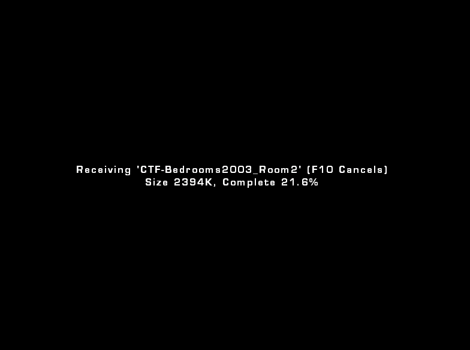
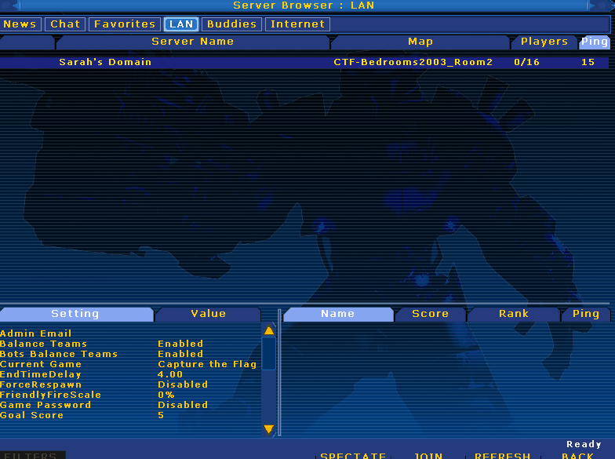
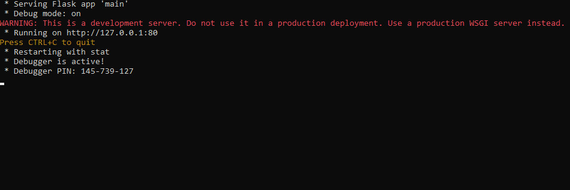

## Unreal Tournament 2004 Redirection Server

I hadn't played UT2004 since I was little and it has always been a favorite of mine. I used to run my own dedicated server off a Windows XP SP3 machine hooked into my parents DSL line. It was a little nerdy girl's dream.

## Lan Focused
Recently I decided to setup a server again and I was reminded that the game downloads are horrendously slow without a redirect server and while some redirection servers may amazingly still be online they either may not include all the files I need or they don't work well for small lan parties.

## The Solution

This application runs anywhere python runs, and for my Windows users I even provide you an executable so you don't need to figure out python if you don't want to.

You simply update the config.ini file with the location of your UT2004 server and it will make all necessary files available to the redirection service. By default it runs on port 80 localhost but you could bind it for internet use if you really wanted to.

That's it, you don't have to put the files in a special place or do anything fancy, just point it to your server, add some file extensions if needed and run it.


## Config

Simply update it with additional file extensions, the location of your server files and the host if you need to change it.

```
[server]
directory = C:\DedicatedUT2004ServerFiles
extensions = utx, ukx, ut2, uax, usx
host = 127.0.0.1
```

## Update UT2004.ini

Update the redirection settings on your UT2004.ini config file so the game knows where to look.

```
[IpDrv.HTTPDownload]
RedirectToURL=http://127.0.0.1/
ProxyServerHost=
ProxyServerPort=3128
UseCompression=False
```

## Examples

### Without Redirect


### With Redirect


### Server Running on Windows



## Support

My name is Sarah Rose, and I like to make stuff. If you've found this useful I have a patreon at https://patreon.com/SarahRoseLives if you'd like to help support my projects or just to say thanks.